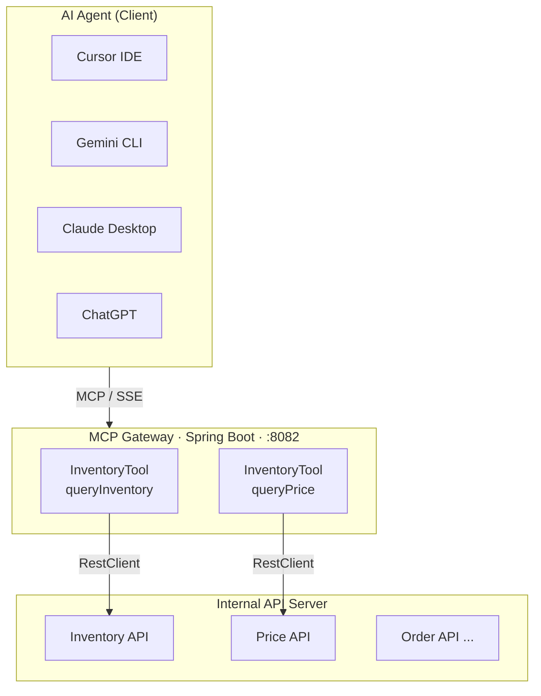
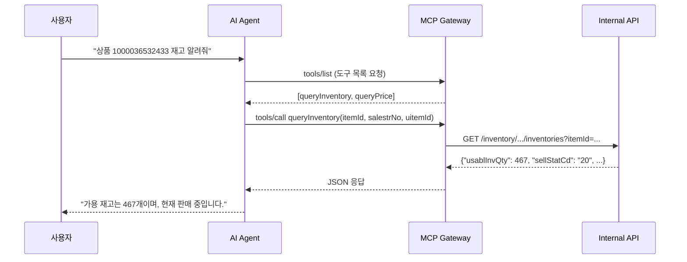
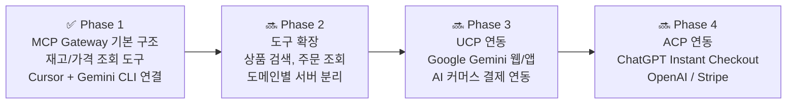

# MCP Gateway

> 사내 API를 MCP(Model Context Protocol) 표준으로 노출하여 다양한 AI 에이전트와 연결하는 게이트웨이

---

## 개요

MCP Gateway는 사내 API들을 AI 에이전트(Gemini, ChatGPT, Claude, Cursor 등)가 사용할 수 있도록 **MCP 표준**으로 감싸주는 Spring Boot 서버입니다.

MCP로 한번 구현해두면 모든 AI 에이전트에서 재사용이 가능하며, 장기적으로 **Google UCP**, **OpenAI ACP** 연동을 통해 소비자 대상 AI 커머스 플랫폼과도 연결할 수 있습니다.

---

## 시스템 아키텍처



---

## MCP 동작 흐름



---

## 로드맵



---

## 기술 스택

| 항목 | 기술 |
|------|------|
| **언어** | Java 17 |
| **프레임워크** | Spring Boot 3.4.5 |
| **MCP 라이브러리** | Spring AI MCP 1.0.0 |
| **빌드 도구** | Gradle 8.12 |
| **전송 방식** | SSE (Server-Sent Events) |
| **포트** | 8082 |
| **HTTP 클라이언트** | Spring RestClient |

---

## 프로젝트 구조

```
mcp_gateway/
├── start.sh                              # 서버 시작 스크립트
├── build.gradle                          # 의존성 설정
├── .cursor/mcp.json                      # Cursor MCP 연결 설정
├── docs/
│   ├── prd.md                            # 제품 요구사항 정의서
│   └── tasks.md                          # 개발 작업 체크리스트
└── src/main/
    ├── java/com/example/mcpgateway/
    │   ├── McpGatewayApplication.java
    │   ├── config/
    │   │   └── RestClientConfig.java     # RestClient + 도구 등록
    │   └── tool/
    │       └── InventoryTool.java        # MCP 도구 (재고/가격 조회)
    └── resources/
        └── application.yml               # 서버 설정
```

---

## 등록된 MCP 도구

### `queryInventory` — 재고 조회
| 파라미터 | 타입 | 설명 |
|---------|------|------|
| `itemId` | String | 상품 ID |
| `salestrNo` | String | 판매처 번호 |
| `uitemId` | String | 단위 상품 ID |

**응답 주요 필드**

| 필드 | 설명 |
|------|------|
| `usablInvQty` | 가용 재고 수량 |
| `sellStatCd` | 판매 상태 코드 (20: 판매중) |
| `itemRsvtShppPsblYn` | 예약배송 가능 여부 |

---

### `queryPrice` — 판매가 조회
| 파라미터 | 타입 | 설명 |
|---------|------|------|
| `itemId` | String | 상품 ID |
| `salestrNo` | String | 판매처 번호 |
| `uitemId` | String | 단위 상품 ID |

**응답 주요 필드**

| 필드 | 설명 |
|------|------|
| `sellprc` | 판매가 |
| `splprc` | 공급가 |
| `mrgrt` | 마진율 |
| `maxSellprc` | 최대 판매가 |

---

## 시작하기

### 1. 서버 실행

```bash
# 첫 실행 또는 코드 변경 후 (빌드 포함)
./gradlew bootJar && ./start.sh

# 코드 변경 없을 때 (빠른 실행)
./start.sh
```

### 2. Cursor IDE 연결

`.cursor/mcp.json` 설정 후 Cursor Settings > MCP에서 `mcp-gateway` 활성화

```json
{
  "mcpServers": {
    "mcp-gateway": {
      "url": "http://localhost:8082/sse"
    }
  }
}
```

### 3. Gemini CLI 연결

```bash
# ~/.gemini/settings.json
{
  "apiKey": "YOUR_GEMINI_API_KEY",
  "mcpServers": {
    "mcp-gateway": {
      "url": "http://localhost:8082/sse",
      "trust": true
    }
  }
}
```

```bash
# 대화 모드
GEMINI_API_KEY=YOUR_KEY gemini --no-sandbox

# 한 줄 질문
echo '상품 1000036532433 재고 조회해줘' | GEMINI_API_KEY=YOUR_KEY gemini --no-sandbox
```

---

### 4. 새 API 도구 추가 방법

```java
// InventoryTool.java에 메서드 추가
@Tool(description = "도구 설명")
public String newTool(
        @ToolParam(description = "파라미터 설명") String param) {
    return restClient.get()
            .uri("/new/api/endpoint")
            .retrieve()
            .body(String.class);
}
```

```bash
# 재빌드 후 재시작
./gradlew bootJar && ./start.sh
```

---

## 연결 테스트 결과

| 클라이언트 | 연결 방식 | 결과 |
|-----------|----------|------|
| Cursor IDE | SSE | ✅ 성공 |
| Gemini CLI | SSE | ✅ 성공 |

---

## 관련 문서

- [PRD (제품 요구사항 정의서)](docs/prd.md)
- [Task List (개발 작업 체크리스트)](docs/tasks.md)
- [MCP 공식 문서](https://modelcontextprotocol.io)
- [Spring AI MCP 문서](https://docs.spring.io/spring-ai/reference/api/mcp/mcp-server-boot-starter-docs.html)
- [Google UCP 문서](https://developers.google.com/merchant/ucp)
